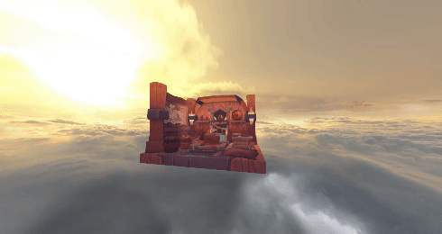

# Description
Personal Graphics Engine built with Vulkan that I'm working on my free time.

# Features
## Implemented
    - Fully renderable 3D Textured Polygons
    - Fully renderable Skybox
    - Scene management (Component/Actor system similar to Unreal Engine)
    - Input Management
    - Functional Graphics API indipendent interface
## To Implement
    - Lighting
    - Shadowmaps
    - 2D sprites rendering
    - ...
